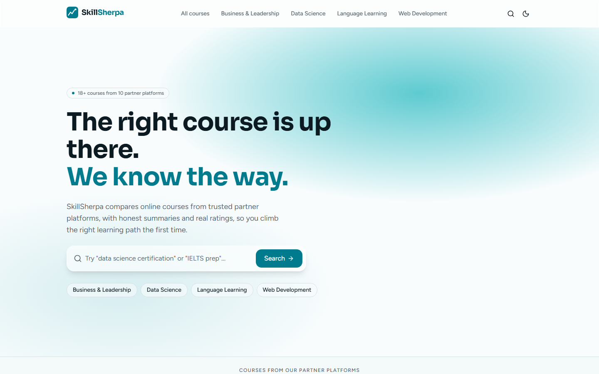
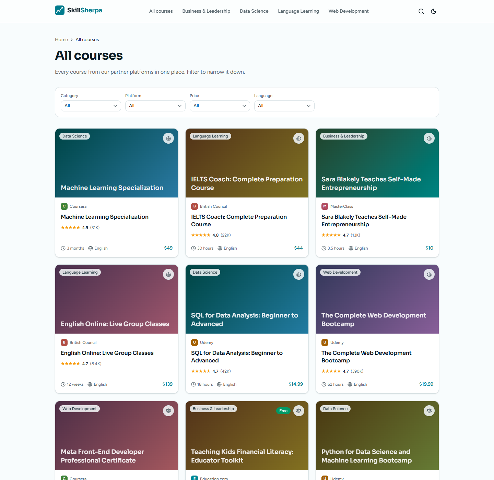
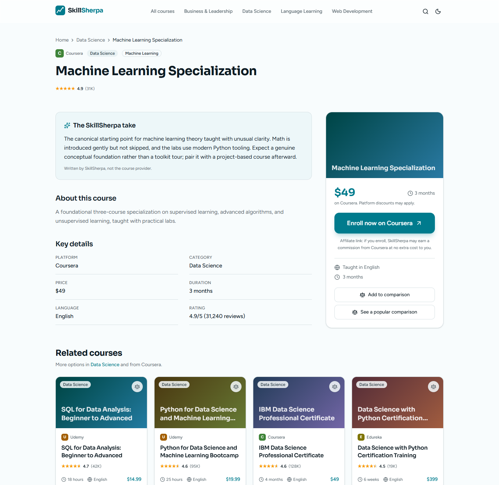

<div align="center">

# SkillSherpa

**An SEO-first online course comparison and discovery platform.**

Search, compare, and enroll in online courses from trusted affiliate partner
platforms — built on Next.js App Router, Supabase, and a from-scratch admin CMS.

[skillsherpa.in](https://skillsherpa.in) · [Report an issue](../../issues)


</div>



## What this is

SkillSherpa aggregates online courses **exclusively** from platforms with an
active affiliate partnership — Coursera, Udemy, Edureka, MasterClass, and
others. There is no scraped content anywhere: every listed course is tied to a
real affiliate relationship, and that rule is enforced at three independent
layers (database trigger, application code, and the admin UI), not just
documented as policy.

Learners search and filter courses, read original AI-assisted summaries, and
compare up to four courses side by side before clicking through to enroll via
a tracked, cloaked affiliate redirect. A non-technical admin manages the
entire catalog — courses, platforms, categories, bulk CSV import — through a
purpose-built CMS, with changes going live instantly via on-demand ISR.

<table>
<tr>
<td width="50%"></td>
<td width="50%"></td>
</tr>
</table>

## Features

**Public site**
- Full-viewport homepage hero with a lazy-loaded React Three Fiber scene (code-split, never blocks LCP), falling back to a static gradient for reduced-motion users and low-end devices
- Category, course detail, and comparison pages — statically generated (`generateStaticParams`) and revalidated on a schedule *and* on-demand the moment an admin edits a course
- Full-text search (Postgres `tsvector`) with debounced autocomplete
- A 4-course comparison tool: pick courses from any listing page via a floating tray, compare them point-by-point (price, rating, duration, language, platform, original summary) on a dedicated page
- Curated `/compare/[a]-vs-[b]` pages targeting high-intent "X vs Y" search queries, statically generated and indexed
- Dark mode from day one via CSS variables (not a Tailwind class hack), respecting system preference
- Every animation is transform/opacity-only and respects `prefers-reduced-motion`

**SEO**
- `generateMetadata` on every route: unique titles, descriptions, canonical URLs, Open Graph/Twitter tags
- JSON-LD structured data: `Organization`, `WebSite`, `Course`, `ItemList`, `BreadcrumbList`, `FAQPage` — required fields are always populated, never emitted blank
- Auto-generated `sitemap.xml` and `robots.txt` (disallowing `/admin`, `/go/`, `/api/`)
- Human-readable, keyword-rich slugs (`/courses/[category]/[slug]`, `/compare/[a]-vs-[b]`), auto-generated from course titles and truncated at word boundaries
- Strategic internal-linking graph: every course links to related courses and its category; footer carries curated "Trending Courses" keyword anchors, all resolved against the live catalog so a link never points at a deleted page
- A trigram-similarity check rejects AI-assisted course summaries that are too close to the platform's own marketing copy, to avoid duplicate-content penalties

**Admin panel**
- Supabase Auth-gated CMS at `/admin` (noindex, disallowed in robots.txt)
- Course CRUD with a live card preview, SEO-friendly slug auto-generation, a Free/Paid price toggle, a 20-currency dropdown (symbols rendered via `Intl`, not a hand-maintained table), and direct image upload to Supabase Storage — any resolution is accepted and cropped cleanly to a fixed aspect ratio on the frontend
- CSV bulk import with a validation preview step; rows referencing a non-affiliate platform are flagged and blocked before anything is committed
- Platform and category management, including per-category SEO title/description fields
- Dashboard with click analytics (recharts), courses-by-platform breakdown, and top-clicked courses
- Every admin server action re-checks authentication server-side; the affiliate-only rule is enforced independently of the UI

**Affiliate tracking**
- Raw affiliate URLs never reach the client — every enroll link routes through `/go/[slug]`, a server route that looks up the real URL, logs an anonymous click (no IP address), and issues a 302
- Google Analytics 4 fires a parallel `enroll_click` event, independent of the server-side click log, so an ad blocker can't silently break affiliate reporting

## Tech stack

| Layer | Choice |
|---|---|
| Framework | Next.js 16 (App Router, React Server Components, TypeScript) |
| Styling | Tailwind CSS v4 + shadcn/ui, CSS-variable theming |
| Animation | Framer Motion (page transitions, card tilt) |
| 3D | React Three Fiber + drei (homepage hero only, code-split) |
| Backend | Supabase — Postgres, Row Level Security, Auth, Storage |
| Search | Postgres full-text search (`tsvector`); swappable for Algolia/Meilisearch if volume grows |
| Forms | react-hook-form + zod |
| Charts | recharts |
| CSV | papaparse |
| Analytics | Google Analytics 4 |
| Hosting | Vercel |

## Getting started

```bash
git clone https://github.com/<your-username>/skillsherpa.git
cd skillsherpa
npm install
npm run dev
```

Open [http://localhost:3000](http://localhost:3000).

**No Supabase project required to explore the app.** Without credentials, it
runs in **local demo mode**: every read and write goes to an in-memory copy of
the seed data (18 courses, 10 partner platforms, 4 categories), and `/admin`
shows an "Enter demo admin" button instead of requiring real auth. Every
feature — including image upload fallback, CSV import, and the compare tool —
is fully exercisable in this mode.

### Connecting a real Supabase project

1. Create a project at [supabase.com](https://supabase.com).
2. Run the migrations in order, via the SQL Editor or `supabase db push`:
   - `supabase/migrations/0001_initial_schema.sql`
   - `supabase/migrations/0002_seed.sql`
   - `supabase/migrations/0003_price_range_two_tier.sql`
3. Copy `.env.example` to `.env.local` and fill in the values (see table below).
4. Create your first admin user in **Supabase Dashboard → Authentication →
   Users → Add user** (email + password, auto-confirmed). Any authenticated
   user is treated as admin — there's no separate roles table.
5. Restart the dev server. Demo mode switches off automatically once real
   credentials are detected.

### Environment variables

| Variable | Required | Description |
|---|---|---|
| `NEXT_PUBLIC_SUPABASE_URL` | for live data | Supabase project URL |
| `NEXT_PUBLIC_SUPABASE_ANON_KEY` | for live data | Supabase anon/public key |
| `SUPABASE_SERVICE_ROLE_KEY` | for live data | **Server-only.** Used for click logging and bulk import. Never expose to the client or commit the real value |
| `NEXT_PUBLIC_SITE_URL` | yes | Canonical origin used in metadata, sitemap, and JSON-LD (e.g. `https://skillsherpa.in`) |
| `NEXT_PUBLIC_GA_MEASUREMENT_ID` | optional | Google Analytics 4 Measurement ID (`G-XXXXXXX`); omit to run without GA |
| `REVALIDATION_SECRET` | for live data | Guards `/api/revalidate`. Generate a real value (`openssl rand -hex 32`) — never use the placeholder in production |
| `GOOGLE_SHEET_ID`, `GOOGLE_SERVICE_ACCOUNT_EMAIL`, `GOOGLE_SERVICE_ACCOUNT_PRIVATE_KEY`, `CRON_SECRET` | optional | Google Sheets course sync and ratings refresh — see below |
| `ANTHROPIC_API_KEY` | optional | Auto-generates a course's AI summary from its description when left blank — see below |

## Google Sheets course sync

Courses can be managed from a Google Sheet instead of (or alongside) the
admin panel: add a row to create a course, edit a row (matched by its
`slug` column) to update one. A scheduled job reads the sheet, upserts
every row through the exact same validation as CSV bulk import, and writes
the resolved `slug`, `status`, and `last_synced` back into the sheet so you
can see what happened without checking logs. This runs fully automatically
— no review step — so double-check a row before saving it in the sheet.

**Sheet columns** (any order, matched by header name): `slug`, `title`,
`platform`, `category`, `subcategory`, `offered_by`, `description`,
`ai_summary`, `price_range` (`free`/`paid`), `price_amount`, `currency`,
`external_rating`, `review_count`, `duration`, `language`,
`enrollment_link`, plus `status` and `last_synced` for the write-back.

The route supports two integration modes:

**Push (recommended)** — a Google Apps Script bound to the sheet itself
POSTs its rows to `/api/cron/sync-sheet` and writes the response back into
the sheet directly. No Google Cloud service account or API key needed at
all, since the script runs under your own Google account, which already
owns the sheet — this sidesteps the `iam.disableServiceAccountKeyCreation`
organization policy that blocks key creation on many Google Cloud projects.
Script source and full setup steps: `docs/apps-script/sync.gs`. Short
version:
1. Open the sheet → **Extensions → Apps Script**, paste in `sync.gs`.
2. **Project Settings → Script Properties** → add `CRON_SECRET` set to the
   same value as the app's `CRON_SECRET` env var.
3. Run the `setupTriggers` function once (authorize when prompted) — this
   schedules `syncCourseSheet` to run automatically twice a day.

**Pull (fallback)** — if a service account key *is* available to you, set
`GOOGLE_SHEET_ID`, `GOOGLE_SERVICE_ACCOUNT_EMAIL`, and
`GOOGLE_SERVICE_ACCOUNT_PRIVATE_KEY` and the route reads + writes the sheet
itself via the Sheets API; trigger it with any external scheduler
(`GET`/`POST /api/cron/sync-sheet`, secret via `Authorization: Bearer` or
`?secret=`).

Either way, generate a `CRON_SECRET` (`openssl rand -hex 32`) and set it in
your environment variables — this guards the route regardless of mode.

## AI summary auto-generation

Whenever a course is saved (admin form, CSV bulk import, or Google Sheets
sync) with `ai_summary` left blank, one is generated automatically from the
`description` via the Anthropic API (`ANTHROPIC_API_KEY`) — a short,
original 2-3 sentence take on who the course is for, written in
SkillSherpa's own voice rather than a reworded copy of the source
description. It runs through the same `checkDistinctness()` guard a
human-written summary must pass (rejecting anything too textually similar to
the description), retrying the prompt automatically up to 3 times if a
generation is too close; never em dashes, by prompt instruction and a
post-processing pass. Typing your own value into the field always takes
priority — generation only fires when it's empty. If `ANTHROPIC_API_KEY`
isn't set, or generation can't produce a sufficiently original result after
retrying, the course still saves fine with `ai_summary` left `null`.

## Rating refresh

`/api/cron/refresh-ratings` re-scrapes `external_rating` and `review_count`
for every active course from its own `enrollment_link`, the same JSON-LD
`aggregateRating` extraction used by "Fetch details" in the admin form, just
without the image/description work that only matters at course-creation
time. A course is skipped (not zeroed out) if the fetch fails or the source
page publishes no rating data, so a transient error never overwrites a good
existing value. Scheduled the same way as the sheet sync — Apps Script
(`docs/apps-script/sync.gs`, `refreshCourseRatings`) runs it every 2 days;
`setupTriggers` schedules both jobs together. Auth uses the same
`CRON_SECRET` as `/api/cron/sync-sheet`.

## Deploying

The app is built for [Vercel](https://vercel.com) — it gets ISR, edge
caching, and `next/image` optimization with zero extra configuration, which
matters directly for Core Web Vitals and therefore SEO ranking.

1. Push this repo to GitHub and import it in Vercel (framework preset:
   Next.js is auto-detected).
2. Add the environment variables above (whichever apply) under
   **Project → Settings → Environment Variables** (Production + Preview).
3. Add your custom domain under **Project → Domains**, and redirect the
   `www` subdomain to the apex (or vice versa) to avoid duplicate-content
   issues — pick one canonical host and make sure it matches
   `NEXT_PUBLIC_SITE_URL`.
4. Post-deploy checklist:
   - `/sitemap.xml` lists the homepage, categories, courses, and comparisons
   - `/robots.txt` disallows `/admin`, `/go/`, `/api/`
   - Editing a course in `/admin` updates the public page within seconds
     (on-demand ISR via `revalidatePath`)
   - `/go/<course-slug>` returns a 302 to the real partner URL and logs a
     row in `click_events`
   - Submit the sitemap in Google Search Console and Bing Webmaster Tools

## Security

- **Row Level Security** on every table: public read access is limited to
  active courses/platforms/categories; all writes require an authenticated
  session; `click_events` reads are admin-only.
- **Affiliate-only catalog enforced at the database layer** — a Postgres
  trigger rejects any course insert/update that references a platform
  without `has_affiliate_program = true`, independent of whatever the
  application or admin UI does.
- **Server-only secrets**: the Supabase service-role key and click-logging
  path are marked `server-only` and can never be imported into client code;
  raw affiliate `enrollment_link` values are stripped from every object sent
  to the browser.
- **No personal data collected.** `click_events` logs a course ID, referrer,
  and user agent only — never an IP address or any visitor identifier.
- **Security headers** (CSP, `X-Frame-Options: DENY`, `X-Content-Type-Options:
  nosniff`, `Referrer-Policy`, `Permissions-Policy`) are set on every response
  via `next.config.ts`.
- **Session refresh middleware** keeps admin auth cookies valid without
  forcing unnecessary re-logins, scoped only to `/admin`.
- `.env*` files and any local secrets are gitignored; nothing in this
  repository's history contains real credentials.

## Project structure

```
src/
├── app/
│   ├── (public)/          # Homepage, categories, courses, compare, search
│   ├── admin/              # Auth-gated CMS: courses, platforms, categories, import
│   ├── api/                # Suggest (autocomplete) and revalidate endpoints
│   ├── go/[slug]/          # Affiliate redirect + click logging
│   ├── sitemap.ts, robots.ts
├── components/             # UI components, shadcn primitives, compare tool
├── lib/
│   ├── data/               # Data access layer (Supabase or demo-mode store)
│   ├── supabase/           # Client/server/admin/public Supabase clients
│   ├── schema.tsx          # JSON-LD builders
│   ├── validation.ts       # zod schemas, slugify, shared constants
│   └── ...
supabase/
└── migrations/             # Schema, seed data, and incremental migrations
```

## Search scaling note

Search runs on Postgres full-text search (`search_courses` in the initial
migration) — plenty for a catalog of hundreds to low-thousands of courses. If
search volume or catalog size outgrows it, swap the implementation inside
`searchCourses`/`getSuggestions` in `src/lib/data/index.ts` for
Algolia/Meilisearch; the rest of the app is agnostic to the search backend.

## License

All rights reserved. This repository is public for portfolio and
demonstration purposes. The code may be viewed for reference and learning,
but reproduction, redistribution, or commercial reuse is not permitted
without permission.

---

<div align="center">Built with Claude Code</div>
